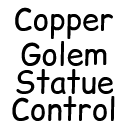

# Copper Golem Statue Control

This is a minecraft mod which adds the ability to control copper golem statues with redstone. The pose is determined by the signal strength of the redstone going into the statue. The mapping is the same as the [vanilla signal strength outputs per pose](https://minecraft.wiki/w/Copper_Golem_Statue#Redstone_component). Signal strengths outside of that mapping will cause no change to the pose of the statue.